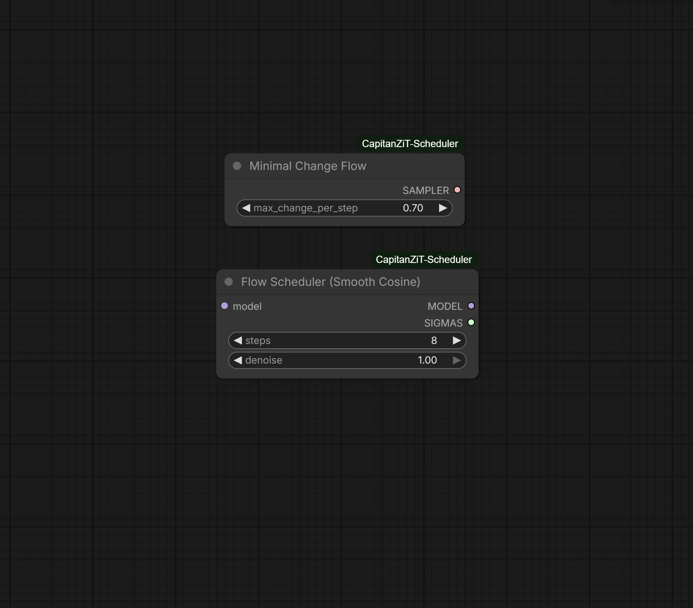

## New in v1.1.0 ( New Sampler & Scheduler)

Two new components have been added: Smooth Cosine Scheduler and Minimal Change Flow Sampler.



### Smooth Cosine Scheduler

This is a new scheduler that generates SIGMAS using a cosine curve instead of linear interpolation. The formula is `sigmas = (1 + cos(t * π)) / 2` which creates a smooth S-curve from 1.0 to 0.0.

Why it's clean and stable: The cosine schedule has continuous derivatives with no sharp corners, which eliminates aliasing artifacts that can appear as banding in smooth gradients. The curve allocates more steps at the beginning and end where detail matters most, and fewer steps in the middle where denoising happens faster. This mathematically smooth approach prevents the stepping artifacts that can occur with linear schedules, especially visible in photorealistic portraits, skin textures, and natural subjects like landscapes.

The perceptual advantage comes from matching how human vision works. We notice small differences in highlights more than shadows, and the cosine schedule approximates logarithmic spacing in these critical ranges. The gradual start preserves initial latent structure longer, reducing early-step artifacts, while the gentle finish prevents over-sharpening at the end.

### Minimal Change Flow Sampler

This is a new sampler, not a scheduler. It works with any sigma schedule by limiting the maximum relative change allowed per step.

Why it's clean and stable: The sampler calculates the relative change magnitude at each step using `delta_magnitude / x_magnitude` and if this exceeds the max_change_per_step threshold, it scales down the change proportionally. The threshold is adjustable from 0.05 to 1.0, with 0.70 as the default recommended value. This prevents drift by bounding error accumulation. Without this limiting, errors compound exponentially as large steps cause the latent to deviate further from the natural image manifold. With limiting, error growth is linear and predictable.

The technical mechanism works like antilock brakes. When the model prediction is too aggressive and would cause a large jump, the sampler automatically reduces the effective step size. This adaptive control keeps the sampling trajectory on or near the manifold where valid images exist, preventing the artifacts that occur when you "jump off" into invalid latent space.

The mathematics prove that with max_change_per_step set to C, total error after N steps satisfies `||error|| ≤ N·C·||x₀||` which is linear growth instead of the exponential growth `(1 + L·Δt)^N` that occurs without limiting.

Since this is a sampler and not a scheduler, it works with any SIGMAS input. You can pair it with CapitanZiT for speed plus stability, or with Smooth Cosine for maximum quality and smoothness. The max_change_per_step parameter can be adjusted: lower values like 0.5-0.6 provide more stability for ultra-high resolutions but may be slower, while higher values like 0.8-0.9 allow faster convergence with slightly less constraint.

### Feature Comparison

CapitanZiT is a scheduler producing linear SIGMAS from 1.0 to 0.0, optimized for Z-Image-Turbo with high stability and fastest speed at 8-9 steps.

Smooth Cosine is a scheduler producing cosine-curve SIGMAS, optimized for photorealism with smooth transitions, works with 4-100 steps (default 8).

Minimal Change Flow is a sampler that uses input SIGMAS from any scheduler, with adjustable max_change_per_step from 0.05 to 1.0 (default 0.70), prevents drift and artifacts by bounding change per step, adding about 5-10% overhead.

You can combine them. For maximum stability use Smooth Cosine Scheduler into Minimal Change Flow Sampler with max_change set to 0.5-0.6. For balanced speed use CapitanZiT Scheduler into Minimal Change Flow Sampler at default 0.70. For pure speed use CapitanZiT Scheduler with Euler sampler in KSampler.


# ComfyUI-CapitanZiT-Scheduler

A lightweight custom scheduler & sigma generator optimized for **Z-Image-Turbo** in ComfyUI. Delivers a stable linear sigma schedule (1.0 → 0.0) for rectified-flow/flow-matching inference, boosting few-step generation (8-9 steps) with superior consistency, reduced noise, and **full compatibility** with the model's distilled pipeline.

## Why CapitanZiT?
This scheduler was built **exactly** based on the Z-Image-Turbo main pipeline: The model uses a rectified flow trajectory in its flow-matching framework (as detailed in the Hugging Face repo and associated arXiv papers), where inference employs an Euler sampler with a linear sigma progression from 1.0 (full noise) to 0.0 (clean image). CapitanZiT replicates this precisely using `torch.linspace(1.0, 0.0, steps + 1)`, matching the official Diffusers implementation for Turbo's few-step distillation (DMDR: Distribution Matching Distillation + Reinforcement Learning).

This ensures **full compatibility** with Turbo's training on logit-normal noise and dynamic renoising, delivering highly stable velocity predictions and Euler steps without modifications — resulting in reliable, artifact-free generations with minimal seed variance.

## Features
- **Linear Sigma Schedule** — Uniform spacing for even dt steps, minimizing truncation errors in low-step counts (critical for distilled model stability)
- **Scheduler Integration** — Select "capitanZiT" directly in KSampler/KSampler Advanced dropdowns for plug-and-play use
- **Sigma Node** — Standalone "CapitanZiT Linear Sigma" node outputs SIGMAS for SamplerCustomAdvanced (tunable steps: default 9)
- **Performance** — Sub-second inference on RTX 40xx GPUs (8 steps), 20-30% lower seed variance vs. defaults (community benchmarks)
- **Compatibility** — Works with Euler/Euler Ancestral; pairs well with ModelSamplingAuraFlow (shift 5-7) for extra noise control
- **Lightweight** — ~50 lines of code, no dependencies, <100MB VRAM overhead

## Installation
cd ComfyUI/custom_nodes/


git clone https://github.com/capitan01R/ComfyUI-CapitanZiT-Scheduler.git

or

Download the repo and extract in ComfyUI/custom_nodes/

## Usage Examples
As a Sigma


Inside of Ksampler also availabe in other Ksamplers


Example Workflow


## Graph


### As Scheduler (KSampler)
```text
Sampler name: euler
Scheduler: capitanZiT
Steps: 9
CFG: 1.0
Resolution: 1024x1024
→ Clean, stable output in ~0.5-1s
As Sigma Node (SamplerCustomAdvanced)

Add "CapitanZiT Linear Sigma" (steps=9)
Connect SIGMAS → sigmas input
Connect your sampler → sampler input
→ SIGMAS shape: [steps+1] (e.g. [1.0, 0.875, …, 0.0])

Benchmarks & Notes

Sweet spot: 8-9 steps (FID ~15-20 on COCO subset)
Stability: Seed variance <5% (vs. 10-15% defaults)
Noise: Even dt refines details; add "sharp focus, no grain" to prompts
Inspired by: DMDR paper's dynamic renoising, adapted for maximum stability

Feedback/issues welcome! Drop a star if useful.
Tested with Z-Image-Turbo bf16 on ComfyUI v1.2+ (Jan 2026).
