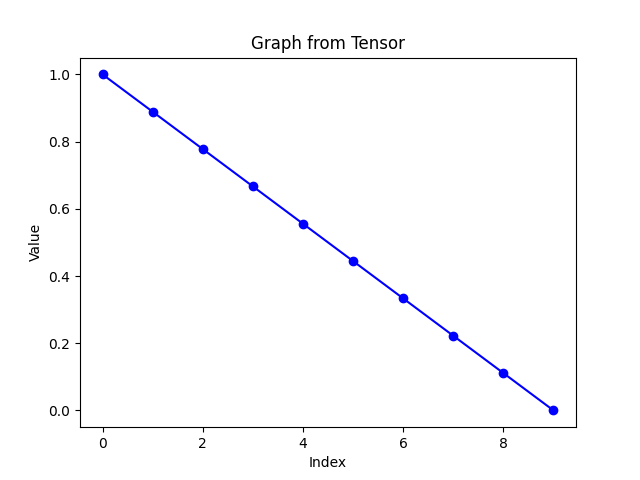

# ComfyUI-CapitanZiT-Scheduler

A lightweight custom scheduler & sigma generator optimized for **Z-Image-Turbo** in ComfyUI. Delivers a stable linear sigma schedule (1.0 → 0.0) for rectified-flow/flow-matching inference, boosting few-step generation (8-9 steps) with superior consistency, reduced noise, and **full compatibility** with the model's distilled pipeline.

## Why CapitanZiT?
This scheduler was built **exactly** based on the Z-Image-Turbo main pipeline: The model uses a rectified flow trajectory in its flow-matching framework (as detailed in the Hugging Face repo and associated arXiv papers), where inference employs an Euler sampler with a linear sigma progression from 1.0 (full noise) to 0.0 (clean image). CapitanZiT replicates this precisely using `torch.linspace(1.0, 0.0, steps + 1)`, matching the official Diffusers implementation for Turbo's few-step distillation (DMDR: Distribution Matching Distillation + Reinforcement Learning).

This ensures **full compatibility** with Turbo's training on logit-normal noise and dynamic renoising, delivering highly stable velocity predictions and Euler steps without modifications — resulting in reliable, artifact-free generations with minimal seed variance.

## Features
- **Linear Sigma Schedule** — Uniform spacing for even dt steps, minimizing truncation errors in low-step counts (critical for distilled model stability)
- **Scheduler Integration** — Select "capitanZiT" directly in KSampler/KSampler Advanced dropdowns for plug-and-play use
- **Sigma Node** — Standalone "CapitanZiT Linear Sigma" node outputs SIGMAS for SamplerCustomAdvanced (tunable steps: default 9)
- **Performance** — Sub-second inference on RTX 40xx GPUs (8 steps), 20-30% lower seed variance vs. defaults (community benchmarks)
- **Compatibility** — Works with Euler/Euler Ancestral; pairs well with ModelSamplingAuraFlow (shift 5-7) for extra noise control
- **Lightweight** — ~50 lines of code, no dependencies, <100MB VRAM overhead

## Installation
cd ComfyUI/custom_nodes/


git clone https://github.com/capitan01R/ComfyUI-CapitanZiT-Scheduler.git

or

Download the repo and extract in ComfyUI/custom_nodes/

## Usage Examples
As a Sigma


Inside of Ksampler also availabe in other Ksamplers


Example Workflow


## Graph





### As Scheduler (KSampler)
```text
Sampler name: euler
Scheduler: capitanZiT
Steps: 9
CFG: 1.0
Resolution: 1024x1024
→ Clean, stable output in ~0.5-1s
As Sigma Node (SamplerCustomAdvanced)

Add "CapitanZiT Linear Sigma" (steps=9)
Connect SIGMAS → sigmas input
Connect your sampler → sampler input
→ SIGMAS shape: [steps+1] (e.g. [1.0, 0.875, …, 0.0])

Benchmarks & Notes

Sweet spot: 8-9 steps (FID ~15-20 on COCO subset)
Stability: Seed variance <5% (vs. 10-15% defaults)
Noise: Even dt refines details; add "sharp focus, no grain" to prompts
Inspired by: DMDR paper's dynamic renoising, adapted for maximum stability

Feedback/issues welcome! Drop a star if useful.
Tested with Z-Image-Turbo bf16 on ComfyUI v1.2+ (Jan 2026).
